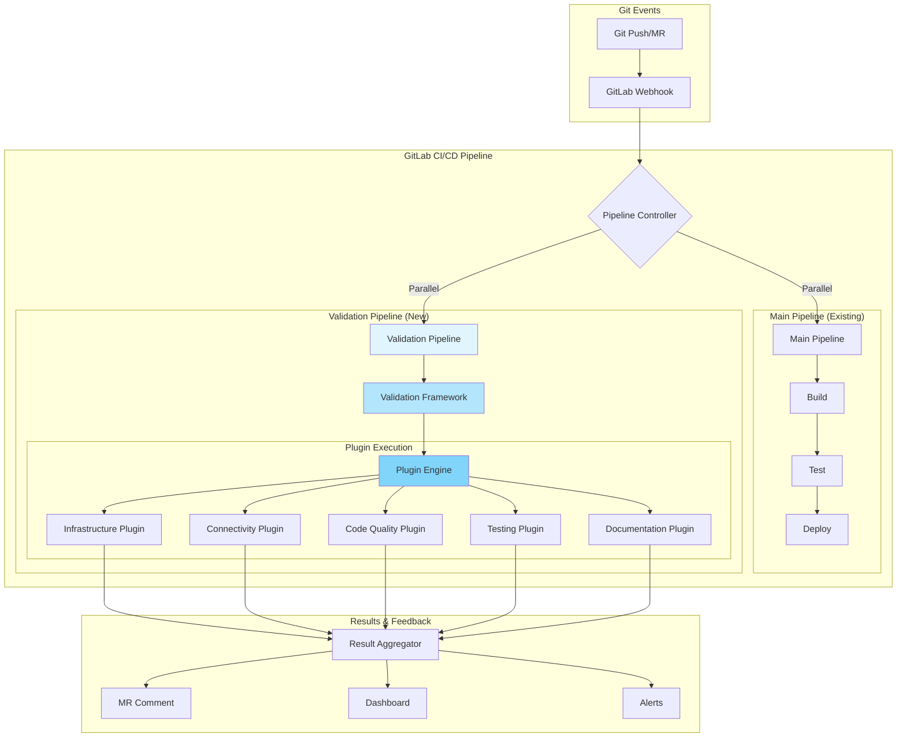
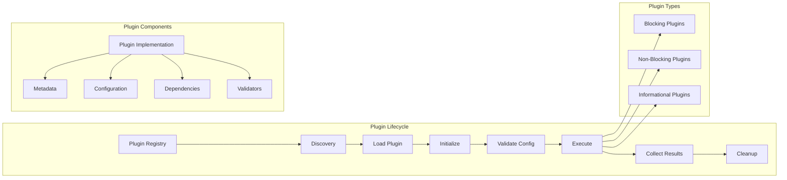
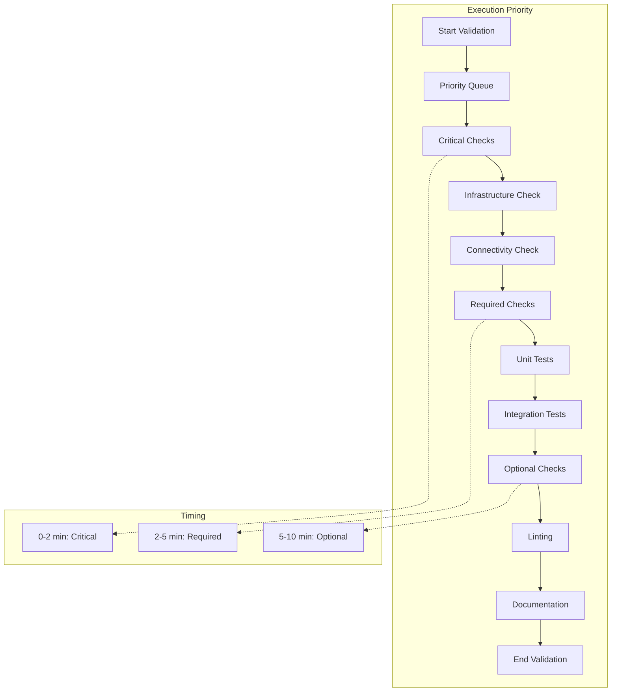
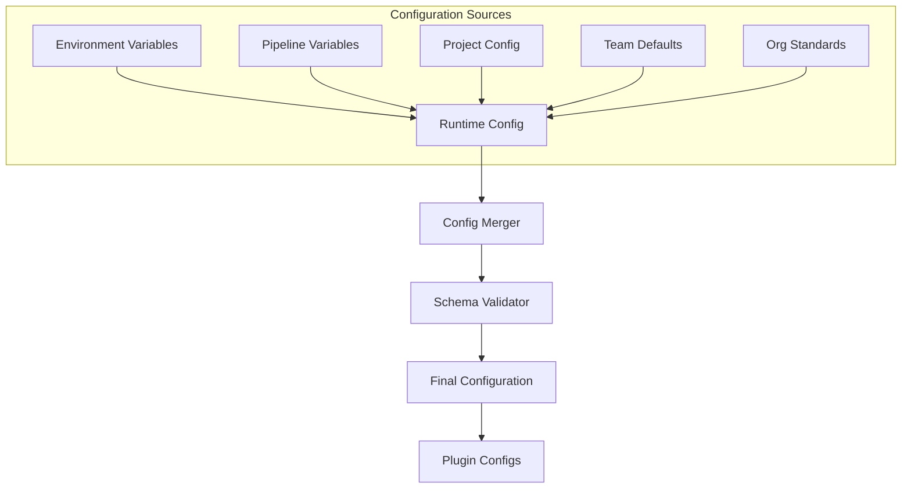
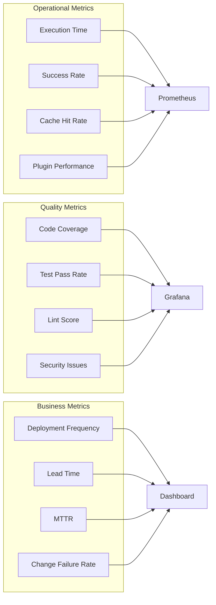

# SAS Viya Pre-Merge Framework - Visual Architecture & Implementation Guide

## Visual Flow Diagrams

### 1. Overall System Flow



### 2. Plugin Architecture Flow



### 3. Execution Priority Matrix



## Implementation Priority Matrix

### Phase 1: Foundation (Week 1-2)

| Component | Priority | Effort | Value | Dependencies |
|-----------|----------|--------|-------|--------------|
| **Core Framework** | P0 | High | Critical | None |
| Plugin Registry | P0 | Medium | Critical | Core Framework |
| Execution Engine | P0 | High | Critical | Plugin Registry |
| Basic Reporting | P0 | Low | High | Execution Engine |
| GitLab Integration | P0 | Medium | Critical | Core Framework |

### Phase 2: Essential Plugins (Week 3-4)

| Plugin | Priority | Effort | Value | Purpose |
|--------|----------|--------|-------|---------|
| **Infrastructure Validator** | P0 | High | Critical | Validate AWS/K8s resources |
| **Connectivity Checker** | P0 | Medium | Critical | Test service connections |
| **Basic PyTest Runner** | P1 | Low | High | Run existing tests |
| **Result Aggregator** | P1 | Medium | High | Consolidate results |

### Phase 3: Enhanced Capabilities (Week 5-6)

| Feature | Priority | Effort | Value | Impact |
|---------|----------|--------|-------|--------|
| **Caching System** | P1 | Medium | High | 50% faster execution |
| **Parallel Execution** | P1 | High | High | 70% time reduction |
| **Linting Suite** | P2 | Low | Medium | Code quality |
| **PyDoc Generator** | P2 | Low | Medium | Documentation |
| **Dashboard** | P2 | Medium | High | Visibility |

### Phase 4: Advanced Features (Week 7-8)

| Feature | Priority | Effort | Value | Benefit |
|---------|----------|--------|-------|---------|
| **ML Predictions** | P3 | High | Medium | Predictive insights |
| **Cost Analysis** | P3 | Medium | Medium | Resource optimization |
| **Custom Plugins** | P2 | Low | High | Team flexibility |
| **Advanced Analytics** | P3 | High | Medium | Trend analysis |

## Plugin Development Templates

### 1. Minimal Plugin Structure

```
minimal-plugin/
├── plugin.yaml              # Essential metadata
├── validator.py            # Core validation logic
└── requirements.txt        # Dependencies
```

### 2. Standard Plugin Structure

```
standard-plugin/
├── metadata.yaml           # Full metadata
├── schema.json            # Config schema
├── src/
│   ├── plugin.py         # Main entry
│   ├── validators/       # Validation modules
│   └── utils/           # Helpers
├── tests/               # Unit tests
└── README.md           # Documentation
```

### 3. Enterprise Plugin Structure

```
enterprise-plugin/
├── metadata.yaml
├── schema.json
├── Dockerfile
├── helm/
│   └── chart/          # Helm deployment
├── src/
│   ├── plugin.py
│   ├── validators/
│   ├── connectors/     # External integrations
│   └── metrics/        # Telemetry
├── tests/
│   ├── unit/
│   ├── integration/
│   └── performance/
├── docs/
│   ├── user-guide.md
│   ├── developer.md
│   └── api.md
└── ci/
    └── .gitlab-ci.yml
```

## Configuration Hierarchy



## Non-Intrusive Integration Patterns

### Pattern 1: Sidecar Validation

```yaml
stages:
  - validate     # New stage - runs parallel
  - build       # Existing
  - test        # Existing
  - deploy      # Existing

validate:pre-merge:
  stage: validate
  allow_failure: true  # Non-blocking
  script:
    - validation-framework run
  only:
    - merge_requests
```

### Pattern 2: Optional Gate

```yaml
validate:gate:
  stage: validate
  script:
    - validation-framework run --mode=strict
  only:
    - branches
  except:
    - master
  allow_failure: false  # Blocking for non-master
```

### Pattern 3: Progressive Enforcement

```yaml
validate:progressive:
  stage: validate
  script:
    - |
      if [[ "$CI_COMMIT_BRANCH" == "develop" ]]; then
        validation-framework run --enforcement=soft
      elif [[ "$CI_COMMIT_BRANCH" == "master" ]]; then
        validation-framework run --enforcement=hard
      else
        validation-framework run --enforcement=none
      fi
```

## Monitoring & Observability

### Key Metrics to Track



## Best Practices

### 1. Plugin Development

| Practice | Description | Benefit |
|----------|-------------|---------|
| **Single Responsibility** | One plugin, one concern | Maintainability |
| **Fail Fast** | Early validation of prerequisites | Time savings |
| **Graceful Degradation** | Handle failures without crashing | Resilience |
| **Rich Logging** | Detailed execution traces | Debugging |
| **Version Everything** | Semantic versioning for plugins | Compatibility |

### 2. Configuration Management

| Practice | Description | Example |
|----------|-------------|---------|
| **Environment Parity** | Similar configs across envs | dev ≈ staging ≈ prod |
| **Secret Management** | Never hardcode secrets | Use Vault/ENV vars |
| **Override Hierarchy** | Clear precedence rules | ENV > Pipeline > Project |
| **Schema Validation** | Validate all configs | JSON Schema |
| **Default Values** | Sensible defaults | Reduce configuration burden |

### 3. Performance Optimization

| Technique | Implementation | Impact |
|-----------|----------------|--------|
| **Caching** | Redis for results | 50% faster |
| **Parallelization** | Concurrent plugins | 70% faster |
| **Lazy Loading** | Load on demand | Lower memory |
| **Connection Pooling** | Reuse connections | Reduced latency |
| **Incremental Validation** | Check only changes | 80% faster |

## Integration Checklist

### Pre-Integration
- [ ] Review existing pipeline structure
- [ ] Identify validation requirements
- [ ] Define success criteria
- [ ] Plan rollout strategy
- [ ] Prepare documentation

### Integration Steps
- [ ] Add validation framework to project
- [ ] Configure GitLab CI includes
- [ ] Set up runner tags
- [ ] Configure plugins
- [ ] Test in feature branch
- [ ] Enable for development
- [ ] Monitor metrics
- [ ] Gather feedback
- [ ] Adjust configuration
- [ ] Roll out to staging
- [ ] Enable for production

### Post-Integration
- [ ] Monitor performance metrics
- [ ] Review failure patterns
- [ ] Optimize slow validators
- [ ] Update documentation
- [ ] Train team members

## Common Patterns & Anti-Patterns

### ✅ Recommended Patterns

1. **Progressive Adoption**
   - Start with informational mode
   - Gradually increase enforcement
   - Allow team-specific overrides

2. **Smart Caching**
   - Cache infrastructure checks (5 min TTL)
   - Cache connectivity tests (2 min TTL)
   - Never cache code quality checks

3. **Failure Isolation**
   - Run plugins in separate containers
   - Use circuit breakers
   - Implement retry logic

### ❌ Anti-Patterns to Avoid

1. **Blocking Everything**
   - Don't make all checks blocking
   - Allow manual overrides
   - Consider context (hotfix vs feature)

2. **Over-Validation**
   - Don't validate unchanging resources
   - Skip expensive checks for small changes
   - Use incremental validation

3. **Poor Communication**
   - Don't hide results in logs
   - Always comment on MR
   - Provide actionable feedback

## Success Metrics

### Week 1-2 Goals
- Framework deployed
- Single team onboarded
- Basic plugins running
- Results visible in MR

### Week 3-4 Goals
- 25% team adoption
- <10 min validation time
- 95% success rate
- Infrastructure checks live

### Week 5-6 Goals
- 50% team adoption
- <5 min validation time
- Caching implemented
- Dashboard available

### Week 7-8 Goals
- 75% team adoption
- Full plugin suite
- Soft enforcement enabled
- Metrics tracked

### Long-term Success Indicators
- 90% reduction in deployment failures
- 50% reduction in incident resolution time
- 100% team adoption
- <5% false positive rate
- 99.9% framework availability

## Quick Reference

### CLI Commands
```bash
# Run validation
validation-framework run

# Run specific plugins
validation-framework run --plugins=infra,connectivity

# Run in strict mode
validation-framework run --mode=strict

# Generate report
validation-framework report --format=html

# List available plugins
validation-framework plugins list

# Install plugin
validation-framework plugins install <name>
```

### Environment Variables
```bash
VALIDATION_MODE=progressive
VALIDATION_TIMEOUT=600
VALIDATION_CACHE_TTL=300
VALIDATION_PARALLEL=true
VALIDATION_PLUGINS=infra,connectivity,pytest
VALIDATION_ENFORCEMENT=soft
```

### Configuration Snippet
```yaml
# .validation.yml
version: "1.0"
mode: progressive
plugins:
  infrastructure:
    enabled: true
    critical: true
  connectivity:
    enabled: true
    critical: false
  pytest:
    enabled: true
    paths:
      - tests/
  linting:
    enabled: true
    blocking: false
```

---

**Quick Links:**
- [Full Design Document](./sas_viya_premerge_framework_design.md)
- [Plugin Development Guide](#plugin-development-templates)
- [Integration Checklist](#integration-checklist)
- [Success Metrics](#success-metrics)
