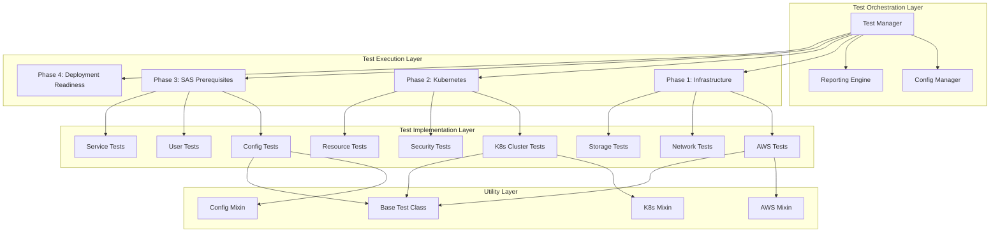
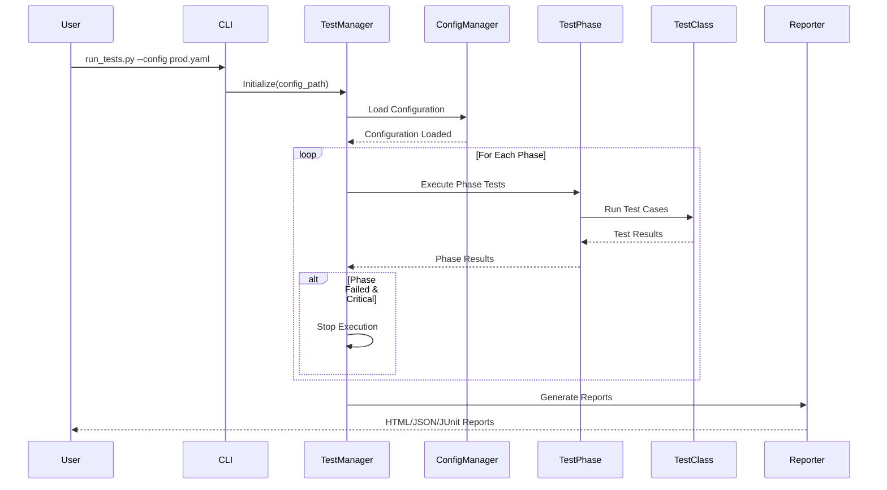
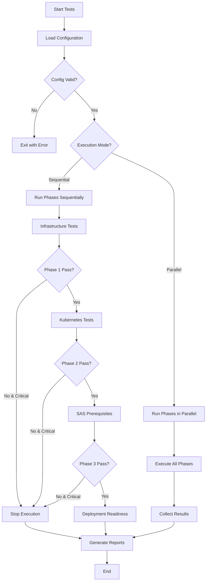

# SAS Viya Test Framework - Architecture Diagrams & Quick Reference

## Framework Architecture Overview



## Test Execution Flow



## Phase Dependencies

```mermaid
graph LR
    subgraph "Phase 1: Infrastructure"
        A1[VPC/Network] --> A2[IAM/Security]
        A2 --> A3[EKS Cluster]
        A3 --> A4[Storage/EFS]
    end
    
    subgraph "Phase 2: Kubernetes"
        B1[Namespace] --> B2[RBAC]
        B2 --> B3[Storage Class]
        B3 --> B4[Resource Quotas]
    end
    
    subgraph "Phase 3: SAS Prerequisites"
        C1[YAML Config] --> C2[Users/Groups]
        C2 --> C3[File System]
        C3 --> C4[External Services]
    end
    
    subgraph "Phase 4: Deployment"
        D1[Image Registry] --> D2[Monitoring]
        D2 --> D3[Backup]
    end
    
    A4 --> B1
    B4 --> C1
    C4 --> D1
    
    style A1 fill:#f9f,stroke:#333,stroke-width:4px
    style B1 fill:#bbf,stroke:#333,stroke-width:4px
    style C1 fill:#bfb,stroke:#333,stroke-width:4px
    style D1 fill:#fbb,stroke:#333,stroke-width:4px
```



## Quick Reference Guide

### 1. Test Categories by Phase

| Phase | Category | Critical | Tests | Purpose |
|-------|----------|----------|-------|---------|
| **Infrastructure** | AWS Resources | ✅ Yes | VPC, Subnets, Security Groups, IAM, EKS | Validate cloud infrastructure |
| | Network | ✅ Yes | DNS, Ports, Connectivity, Firewall | Ensure network readiness |
| | Storage | ✅ Yes | EFS/NFS, S3, Disk Space | Verify storage configuration |
| **Kubernetes** | Cluster Health | ✅ Yes | Nodes, Control Plane, CoreDNS | Validate K8s cluster |
| | Security | ✅ Yes | RBAC, PSP, Network Policies | Check security settings |
| | Resources | ✅ Yes | CPU, Memory, Quotas | Verify resource availability |
| **SAS Prerequisites** | Configuration | ✅ Yes | YAML files, Kustomize, Licenses | Validate SAS configs |
| | Permissions | ✅ Yes | Users, Groups, File System | Check OS-level requirements |
| | Integration | ✅ Yes | Database, LDAP, Storage | Test external services |
| **Deployment Readiness** | Registry | ⚠️ No | Image Pull, Mirrors | Verify container registry |
| | Observability | ⚠️ No | Prometheus, Grafana, Logs | Check monitoring setup |
| | Recovery | ⚠️ No | Backups, Snapshots | Validate DR capabilities |

### 2. Key Test Methods

```python
# Infrastructure Tests
verify_vpc_configuration(vpc_id)
verify_iam_role(role_name)
check_eks_cluster(cluster_name)
verify_s3_bucket(bucket_name)

# Kubernetes Tests
check_namespace_exists(namespace)
check_pod_status(namespace, selector)
verify_deployment(name, namespace)
get_storage_classes()
check_pvc_status(namespace)

# Configuration Tests
validate_yaml_syntax(file_path)
check_required_keys(config, keys)
validate_schema(data, schema)

# Common Assertions
assert_with_retry(callable, expected, retries=3)
skip_if_not_applicable(condition, reason)
```

### 3. Configuration Variables

| Variable | Environment Variable | Default | Description |
|----------|---------------------|---------|-------------|
| environment.name | ENVIRONMENT | development | Environment name |
| environment.region | AWS_REGION | us-east-1 | AWS region |
| environment.cluster_name | CLUSTER_NAME | sas-viya-eks | EKS cluster name |
| aws.vpc.id | VPC_ID | vpc-12345678 | VPC identifier |
| aws.subnets.private | PRIVATE_SUBNET_* | - | Private subnet IDs |
| aws.subnets.public | PUBLIC_SUBNET_* | - | Public subnet IDs |
| aws.security_groups | SG_ID | sg-12345678 | Security group IDs |

### 4. Command Line Usage

```bash
# Run all tests
python run_tests.py --config configs/prod.yaml

# Run specific phase
python run_tests.py --phase infrastructure --config configs/prod.yaml

# Run tests in parallel
python run_tests.py --parallel --workers 8 --config configs/prod.yaml

# Verbose output
python run_tests.py --verbose --config configs/dev.yaml

# Environment-specific
export ENVIRONMENT=production
export AWS_REGION=us-west-2
export CLUSTER_NAME=sas-viya-prod
python run_tests.py
```

### 5. Test Execution Decision Tree



### 6. Error Categories and Recovery

| Error Category | Example | Recovery Strategy | Auto-Retry |
|---------------|---------|-------------------|------------|
| **Infrastructure** | VPC not found | Check CloudFormation/Terraform | No |
| **Configuration** | Invalid YAML | Fix syntax errors | No |
| **Permission** | IAM role missing | Update policies | No |
| **Connectivity** | Network timeout | Retry with backoff | Yes |
| **Resource** | Insufficient nodes | Scale cluster | No |
| **Timeout** | Test timeout | Increase timeout value | Yes |
| **Dependency** | Service unavailable | Wait and retry | Yes |

### 7. Report Structure

```
test-reports/
├── summary_20240109_143022.json       # Overall summary
├── phase_infrastructure_20240109.html  # Phase-specific HTML
├── phase_kubernetes_20240109.html     
├── phase_sas_prereq_20240109.html     
├── metrics_20240109_143022.json       # Performance metrics
├── recommendations_20240109.txt       # Failure recommendations
└── junit_results.xml                  # CI/CD integration
```

### 8. Plugin Development Template

```python
# framework/plugins/custom_plugin.py

from framework.core.base_test import SASViyaBaseTest
from abc import ABC, abstractmethod

class CustomTestPlugin(ABC):
    """Template for custom test plugin"""
    
    def __init__(self, config):
        self.config = config
        self.name = "CustomPlugin"
        self.version = "1.0.0"
    
    @abstractmethod
    def get_test_classes(self):
        """Return list of test classes"""
        return [CustomTests]
    
    @abstractmethod
    def get_configuration_schema(self):
        """Return configuration schema"""
        return {
            "type": "object",
            "properties": {
                "custom_setting": {"type": "string"}
            }
        }

class CustomTests(SASViyaBaseTest):
    """Custom test implementation"""
    
    def test_custom_validation(self):
        """Custom validation test"""
        # Your test implementation
        self.assertTrue(True, "Custom test passed")
```

### 9. CI/CD Integration Examples

#### Jenkins Pipeline
```groovy
pipeline {
    agent any
    stages {
        stage('Pre-Deployment Validation') {
            steps {
                script {
                    def testResult = sh(
                        script: 'python run_tests.py --config prod.yaml',
                        returnStatus: true
                    )
                    if (testResult != 0) {
                        error("Pre-deployment tests failed")
                    }
                }
            }
        }
    }
    post {
        always {
            junit 'reports/junit_results.xml'
            publishHTML([
                reportDir: 'reports',
                reportFiles: '*.html',
                reportName: 'SAS Viya Test Report'
            ])
        }
    }
}
```

#### GitLab CI
```yaml
validate-sas-viya:
  stage: test
  script:
    - pip install -r requirements.txt
    - python run_tests.py --config $CI_ENVIRONMENT_NAME.yaml
  artifacts:
    when: always
    reports:
      junit: reports/junit_results.xml
    paths:
      - reports/
    expire_in: 30 days
  only:
    - master
    - develop
```

#### GitHub Actions
```yaml
name: SAS Viya Pre-Deployment Tests
on:
  workflow_dispatch:
  push:
    branches: [main, develop]

jobs:
  validate:
    runs-on: ubuntu-latest
    steps:
      - uses: actions/checkout@v3
      
      - name: Set up Python
        uses: actions/setup-python@v4
        with:
          python-version: '3.9'
      
      - name: Install dependencies
        run: |
          pip install -r requirements.txt
      
      - name: Run tests
        run: |
          python run_tests.py --config configs/${{ github.ref_name }}.yaml
        env:
          AWS_REGION: ${{ secrets.AWS_REGION }}
          CLUSTER_NAME: ${{ secrets.CLUSTER_NAME }}
      
      - name: Upload test results
        if: always()
        uses: actions/upload-artifact@v3
        with:
          name: test-results
          path: reports/
```

### 10. Troubleshooting Quick Reference

| Issue | Check | Solution |
|-------|-------|----------|
| Tests not found | Module path | Ensure PYTHONPATH includes framework directory |
| Config not loaded | File path | Check TEST_CONFIG_PATH env var |
| K8s connection failed | Kubeconfig | Verify ~/.kube/config or in-cluster config |
| AWS auth failed | Credentials | Check AWS_PROFILE or IAM role |
| Timeout errors | Network | Increase timeout values in config |
| Import errors | Dependencies | Run `pip install -r requirements.txt` |
| Permission denied | User context | Run as appropriate user or with sudo |
| Parallel execution issues | Resource locks | Reduce worker count or use sequential mode |

## Best Practices

1. **Always run tests in order**: Infrastructure → Kubernetes → SAS Prerequisites → Deployment
2. **Use configuration files**: Don't hardcode values
3. **Enable verbose logging**: For troubleshooting failures
4. **Save test artifacts**: Reports, logs, and metrics for audit
5. **Run in CI/CD**: Automate validation before each deployment
6. **Customize for environment**: Dev, staging, and prod configs
7. **Monitor test duration**: Set appropriate timeouts
8. **Document custom tests**: Maintain test documentation
9. **Version control configs**: Track configuration changes
10. **Regular framework updates**: Keep dependencies current

---
**Quick Links:**
- [Framework Design](./sas_viya_test_framework_design.md)
- [Implementation Guide](./sas_viya_implementation_guide.md)
- [Configuration Examples](./configs/)
- [Test Reports](./reports/)
